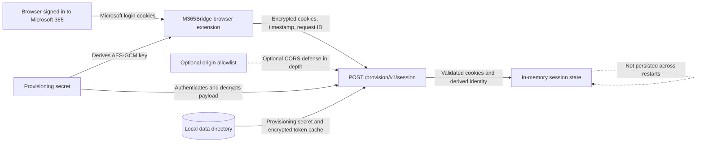
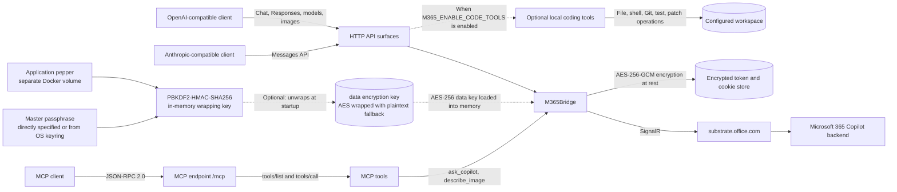

# [M365Bridge](https://github.com/KilimcininKorOglu/M365Bridge) + Auth tokens via Browser Extension

A Go implementation that converts Microsoft 365 Copilot's WebSocket interface to OpenAI/Anthropic compatible HTTP API.
On top of the original [M365Bridge](https://github.com/KilimcininKorOglu/M365Bridge), here a browser extension helps securely transferring auth tokens from the user's browser (logged in on M365) to the M365Bridge running process.


## Architecture

### Session provisioning



The provisioned browser cookies and derived identity remain in memory. Local persistent data can include the provisioning secret, encrypted token cache, cache data, transcripts, and the token-encryption key. Exact extension origins are an optional browser-facing restriction; the provisioning secret remains the authorization boundary.

### API and MCP calls



The MCP surface exposes `ask_copilot` and `describe_image`. Separately, the opt-in coding-tool runtime can expose workspace-confined file listing, reading, writing and searching; shell commands; Git status, diff and log; test execution; and patch application.

## Prerequisites

- **Docker** for a container build, or **Go 1.26+** for local compilation ([download Go](https://go.dev/dl/)). Go 1.21 and newer can download the required 1.26 toolchain automatically unless `GOTOOLCHAIN` is set to `local`.
- A **Microsoft 365 Copilot license** (business or enterprise account with Copilot access). A Copilot Chat basic account has also been tested.
- A browser signed in to [https://m365.cloud.microsoft](https://m365.cloud.microsoft) for authentication through the browser extension or the legacy setup wizard.

## Features

- Text chat with streaming/non-streaming output
- Multimodal image input (OpenAI `image_url` and Anthropic `image` content blocks; PNG, JPEG, GIF, WebP)
- Image generation through Microsoft Designer (`/v1/images/generations`, `/v1/images/edits`) with `url` and `b64_json` response formats
- Multi-turn conversation support via ConversationId tracking
- Session isolation (per-session M365 conversations)
- Thinking/reasoning content extraction (`reasoning_content` for OpenAI, `thinking` blocks for Anthropic)
- Simulated tool calling (client-defined tools work on both OpenAI and Anthropic endpoints, streaming and non-streaming)
- OpenAI-compatible API endpoints, including the Responses API and its compaction route
- Anthropic-compatible API endpoints (dedicated SSE handlers)
- Model Context Protocol server on `/mcp` (JSON-RPC 2.0)
- Built-in coding tools the gateway runs locally, off unless `M365_ENABLE_CODE_TOOLS` turns them on
- Stop sequences on every chat endpoint, cut as the answer streams
- API key authentication (`M365_API_KEYS` / `M365_API_KEY`)
- max_tokens enforcement across all endpoints (tiktoken BPE)
- Conversation quota counters on `/v1/quota`
- CLI interface for interactive use
- Browser interface compiled into the binary (conversation list, streaming chat, model picker, markdown answers, English and Turkish)
- Single binary with subcommand routing

## Installation

#### Step 1: Create the provisioning secret

Generate a high-entropy secret inside the `data/` directory:

```bash
mkdir -p data
head -c 24 /dev/urandom | base64 > data/provision-secret
chmod 600 data/provision-secret
```

Keep `data/provision-secret` private. The browser extension uses this secret to encrypt and authenticate session provisioning requests.

Alternatively, `docker-compose.provision-secret.yml` reads the secret from a `M365_PROVISION_SECRET` shell variable instead of a file, via a [Compose secret](https://docs.docker.com/compose/how-tos/use-secrets/). Layer it in with `-f` (see [Encrypting cached tokens at rest](docs/token-encryption.md) for the same pattern applied to the master passphrase).

#### Step 2: Build M365Bridge and package the extension

Package the browser extension:

```bash
node extension/package.js
```

> **Note:** Prefer not to install a browser extension, or want to build from source instead of using Docker? The upstream project documents both: a manual, extension-free token setup using a browser console snippet and its own setup wizard ([Connecting your Microsoft 365 account](https://github.com/KilimcininKorOglu/M365Bridge/blob/main/README.md#connecting-your-microsoft-365-account)), and a from-source build ([Option C: Build from source](https://github.com/KilimcininKorOglu/M365Bridge/blob/main/README.md#option-c-build-from-source)).

#### Step 3: Install the extension

The Chromium package supports Google Chrome, Microsoft Edge, and other compatible Chromium-based browsers. Load the same `extension/dist/chromium` directory in either browser:

- **Google Chrome:** Open `chrome://extensions`, enable **Developer mode**, select **Load unpacked**, and choose `extension/dist/chromium`.
- **Microsoft Edge:** Open `edge://extensions`, enable **Developer mode**, select **Load unpacked**, and choose `extension/dist/chromium`.
- **Firefox:** Open `about:debugging#/runtime/this-firefox`, select **Load Temporary Add-on**, and choose `extension/dist/firefox/manifest.json`.

#### Step 4: Configure and start M365Bridge

Create a project-level `.env` file:

```dotenv
M365_PROVISION_SECRET_FILE=/app/data/provision-secret
M365_PROVISION_AUTHORITY=organizations
```

`M365_PROVISION_ORIGINS` can optionally restrict browser provisioning requests by exact extension origin. See [Provisioning origin filtering](docs/provisioning-origin-filtering.md) for configuration and security details.

The repository includes a ready-to-use [`docker-compose.yml`](docker-compose.yml) that builds the image from the current checkout. Build and start M365Bridge:

```bash
docker compose up --build -d
```

The bridge and provisioning endpoint are now available at `http://localhost:8230`. Browser provisioning requires either `M365_PROVISION_SECRET` or `M365_PROVISION_SECRET_FILE`. If neither is configured, `/provision/v1/session` returns `404 Not Found` and the extension cannot authenticate M365Bridge. The existing `8230:8000` mapping serves both API and provisioning requests.

`M365_PROVISION_AUTHORITY` controls the Microsoft identity authority used for the initial browser provisioning flow. It defaults to `organizations`; set it to `common` or an exact tenant ID when required. The tenant ID derived from the resulting access token still becomes the runtime authority after provisioning.

#### Optional: Encrypt cached tokens at rest

The expected setup uses a master passphrase and a [pepper](https://en.wikipedia.org/wiki/Pepper_%28cryptography%29) to wrap the AES data key in `data/tokens/encryption.key.enc`. If no master passphrase is configured, M365Bridge falls back to storing the key in plaintext at `data/tokens/encryption.key` and prints security warnings. See [Encrypting cached tokens at rest](docs/token-encryption.md) for setup and details.

#### Step 5: Provision the Microsoft 365 session

Sign in to [https://m365.cloud.microsoft](https://m365.cloud.microsoft) in the browser where the extension is installed. Open the extension, enter `http://127.0.0.1:8230` and the value from `data/provision-secret`, then select **Provision M365Bridge**.

The extension encrypts the required Microsoft login cookies with AES-GCM using a key derived from the provisioning secret. The raw secret and plaintext cookies are not sent over the network. Each request includes a short-lived timestamp and one-time request ID to reject stale or replayed payloads.

M365Bridge validates the primary and broker authentication flows, obtains fresh tokens, and derives the current user OID and tenant ID from the access token. Provisioned cookies and the derived identity are kept in memory, so provision again after every container restart or whenever the Microsoft browser session changes.

#### Step 6: Connect OpenCode or another client

Configure OpenCode or any OpenAI-compatible client with this API base URL:

```text
http://127.0.0.1:8230/v1
```

After provisioning succeeds, the client can use the chat, responses, models, and other compatible endpoints documented below.

#### Alternative: docker run

If you prefer `docker run` instead of Docker Compose, build the image from the current source tree first:

```bash
docker build -t m365bridge:local .

docker run -d \
  --name m365bridge \
  -p 8230:8000 \
  -e M365_PROVISION_SECRET_FILE=/app/data/provision-secret \
  -e M365_PROVISION_AUTHORITY=organizations \
  -v "$(pwd)/data:/app/data" \
  --restart unless-stopped \
  m365bridge:local
```

Optional origin filtering is documented in [Provisioning origin filtering](docs/provisioning-origin-filtering.md). Continue with Steps 5 and 6 above.

`docker run` has no equivalent to Compose's env-sourced secrets; see [Encrypting cached tokens at rest](docs/token-encryption.md) for the `docker run` alternative.

#### Notes

- The `data/` directory stores tokens, cache, and configuration. It is created automatically on first run.
- Port `8230` (host) maps to port `8000` (container). Change the host port in `docker-compose.yml` or the `-p` flag if needed.
- The container starts with `serve --port 8000` by default.
- Browser provisioning uses the existing server port and does not require another published port.
- Without a master passphrase configured, `data/tokens/encryption.key` is a plaintext AES key; anyone who can read the `data/` directory can decrypt cached tokens. See [Encrypting cached tokens at rest](docs/token-encryption.md).

## Usage

### Core Environment Variables

Configuration is read from `data/.env`; a process environment variable takes precedence over the file. The setup wizard writes the first two.

| Variable         | Default                                | Description                                                                                          |
|------------------|----------------------------------------|------------------------------------------------------------------------------------------------------|
| `M365_TENANT_ID` | required                               | Directory (tenant) ID. The CLI and the server both exit without it.                                  |
| `M365_USER_OID`  | required                               | Object ID of the signed-in user. The CLI and the server both exit without it.                        |
| `M365_CLIENT_ID` | `4765445b-32c6-49b0-83e6-1d93765276ca` | OAuth client the access tokens are issued to. Change it only for a tenant that blocks the default.   |
| `M365_API_KEYS`  | unset                                  | Comma-separated keys a client must present. Unset leaves every `/v1/*` route and `/mcp` open.        |
| `M365_API_KEY`   | unset                                  | A single key, read only when `M365_API_KEYS` is unset.                                               |
| `TZ`             | system zone                            | Timezone sent with each turn. Without it the zone comes from `/etc/localtime`, then UTC.             |

The following variables are specific to this fork:

| Variable | Default | Description |
|----------|---------|-------------|
| `M365_PROVISION_SECRET` | unset | Shared secret used to authenticate browser-extension provisioning. |
| `M365_PROVISION_SECRET_FILE` | unset | File containing the provisioning secret, suitable for container secrets. |
| `M365_PROVISION_ORIGINS` | unset | Comma-separated extension origins allowed to provision. Unset accepts extension origins; `*` disables origin filtering. |
| `M365_PROVISION_AUTHORITY` | `organizations` | Microsoft identity authority used during provisioning. |
| `M365_MASTER_PASSPHRASE_VALUE` | unset | Master passphrase used to wrap the credential-encryption key. Takes precedence over the file setting. |
| `M365_MASTER_PASSPHRASE_FILE` | unset | File containing the master passphrase used to wrap the credential-encryption key. |

`m365-bridge --help` prints all supported variables with their current defaults.

For additional command-line, HTTP API, session, and configuration details omitted from this streamlined guide, see the [original M365Bridge README](https://github.com/KilimcininKorOglu/M365Bridge#readme).

### OpenCode

Create or update the global OpenCode configuration file at `~/.config/opencode/opencode.json` (or `~/.config/opencode/opencode.jsonc`) with the following provider configuration:

```json
{
  "$schema": "https://opencode.ai/config.json",
  "provider": {
    "m365bridge": {
      "npm": "@ai-sdk/openai-compatible",
      "name": "m365bridge",
      "options": {
        "baseURL": "http://localhost:8230/v1",
        "apiKey": "****************"
      },
      "models": {
        "gpt-5.6-reasoning": {
          "name": "gpt-5.6-reasoning",
          "capabilities": {
            "tools": true,
            "input": ["text", "image"],
            "output": ["text"]
          },
          "limit": {
            "context": 200000,
            "output": 50000
          }
        }
      }
    }
  }
}
```

Replace the masked API key with your configured M365Bridge API key (if defined). Quit and restart OpenCode after changing its configuration, then start it directly with this provider and model:

```bash
opencode -m m365bridge/gpt-5.6-reasoning
```

## Web Interface

Open the server's root URL in a browser (`http://localhost:8230/` under the shipped Docker setup). The interface is compiled into the binary, so there is no separate asset directory and no second process to run.

It lists conversations in a sidebar, streams answers as they arrive, lets you pick a model from `GET /v1/models`, and creates, renames and deletes conversations. An answer is rendered as markdown, so a comparison table is a table and a citation is a link rather than a URL in the middle of a sentence. The reasoning block behind **Show the thinking** is rendered the same way, because the backend writes that in markdown too. What you typed is shown exactly as you typed it. Rename and delete ask in the page rather than through the browser's own dialogs.

The [original project documentation](https://github.com/KilimcininKorOglu/M365Bridge#browser-interface) covers interface addresses, transcripts, authentication, localization, and rebuilding the web assets in more detail.

## Models

All model selection is via the `tone` field sent to the M365 backend. The `Override` field is empty for all models. GPT-5.x models route to the GPT-5 backend. Claude tone values return Claude responses, but M365 does not expose the underlying model identity in SignalR metadata.

| Key                        | Tone              | OpenAI ID         | Thinking? | Backend |
|----------------------------|-------------------|-------------------|-----------|---------|
| `auto`                     | Magic             | gpt-4-auto        | No        | GPT-5   |
| `quick`                    | Chat              | gpt-4-quick       | No        | GPT-5   |
| `reasoning`                | Gpt_5_2_Reasoning | gpt-4-reasoning   | Yes       | GPT-5   |
| `gpt5.2-reasoning`         | Gpt_5_2_Reasoning | gpt-5.2-reasoning | Yes       | GPT-5   |
| `gpt5.4-reasoning`         | Gpt_5_4_Reasoning | gpt-5.4-reasoning | Yes       | GPT-5   |
| `gpt5.2`                   | Gpt_5_2_Chat      | gpt-5.2           | No        | GPT-5   |
| `gpt5.3`                   | Gpt_5_3_Chat      | gpt-5.3           | No        | GPT-5   |
| `gpt5.4`                   | Gpt_5_4_Chat      | gpt-5.4           | No        | GPT-5   |
| `gpt5.5`                   | Gpt_5_5_Chat      | gpt-5.5           | No        | GPT-5   |
| `gpt5.5-reasoning`         | Gpt_5_5_Reasoning | gpt-5.5-reasoning | Yes       | GPT-5   |
| `gpt5.6-reasoning`         | Gpt_5_6_Reasoning | gpt-5.6-reasoning | Yes       | GPT-5   |
| `claude`                   | Claude_Sonnet     | claude-sonnet-4.6 | No        | Claude  |
| `claude-sonnet`            | Claude_Sonnet     | claude-sonnet-4.6 | No        | Claude  |
| `claude-opus`              | Claude_Opus       | claude-opus-4.6   | Yes       | Claude  |
| `claude-sonnet-4-20250514` | Claude_Sonnet     | claude-sonnet-4.6 | No        | Claude  |

### Which model should I use?

| Use case                                  | Model              |
|-------------------------------------------|--------------------|
| General purpose, let backend decide       | `auto`             |
| Fast responses, simple questions          | `quick`            |
| Complex reasoning, multi-step problems    | `reasoning`        |
| GPT-5.2 with deep thinking                | `gpt5.2-reasoning` |
| GPT-5.4 with deep thinking                | `gpt5.4-reasoning` |
| GPT-5.2 chat                              | `gpt5.2`           |
| GPT-5.3 chat                              | `gpt5.3`           |
| GPT-5.4 chat                              | `gpt5.4`           |
| GPT-5.5 chat                              | `gpt5.5`           |
| GPT-5.5 with deep thinking                | `gpt5.5-reasoning` |
| GPT-5.6 with deep thinking (latest)       | `gpt5.6-reasoning` |
| Claude Sonnet 4.6 (Anthropic)             | `claude-sonnet`    |
| Claude Opus 4.6 (Anthropic, most capable) | `claude-opus`      |

A reasoning model produces `reasoning_content` output containing the model's thinking process. OpenAI endpoints expose this as `reasoning_content`; Anthropic endpoints expose it as a `thinking` content block before the `text` block. `claude-opus` produces reasoning content as well; `claude-sonnet` does not. `gpt5.6-reasoning` advertises the capability but has not been observed emitting it. The advertised capability comes from the measured behaviour of each tone rather than from its name.

## MCP Server

`POST /mcp` exposes M365 Copilot to Model Context Protocol clients over JSON-RPC 2.0 (protocol revision `2025-06-18`). It supports `initialize`, `tools/list`, `tools/call`, and `ping`; lifecycle notifications are acknowledged with `202` and no body. The route requires an API key when one is configured.

| Tool | Arguments | Description |
|------|-----------|-------------|
| `ask_copilot` | `prompt` (required), `model` | One stateless Copilot turn returning text |
| `describe_image` | `image_url` (required, data URI), `prompt` | Asks Copilot about an inline image |

```bash
curl -s -X POST http://localhost:8000/mcp \
  -H "Content-Type: application/json" \
  -d '{"jsonrpc":"2.0","id":1,"method":"tools/call","params":{"name":"ask_copilot","arguments":{"prompt":"Summarize the CAP theorem"}}}'
```

Copilot is deliberately a leaf in the MCP role. The simulated tool calling used by the `/v1` endpoints is **not** offered through MCP: an MCP client already has a real, schema-enforced tool mechanism, and nesting the prompt-based emulation inside it would create two competing tool loops. Every MCP call is an independent turn with no conversation continuity.

## Tool Calling

M365Bridge supports **simulated tool calling** — client-defined tools (Claude Code's Read/Bash/Write, Codex tools, etc.) work without M365 backend natively supporting them.

### How It Works

1. Client sends a request with `tools` array (OpenAI function definitions or Anthropic tool schemas)
2. M365Bridge embeds the entire request JSON into the prompt sent to M365 Copilot
3. M365 Copilot returns a full response JSON in a ```` ```json ```` block
4. M365Bridge parses the response and extracts tool calls into OpenAI `tool_calls` or Anthropic `tool_use` content blocks
5. Client executes the tool and sends the result back in the next message

This works on both OpenAI (`/v1/chat/completions`) and Anthropic (`/v1/messages`) endpoints, in both streaming and non-streaming modes.

For complete request and response examples, schema validation behavior, client-driven tool loops, and optional built-in coding tools, refer to the [upstream tool-calling documentation](https://github.com/KilimcininKorOglu/M365Bridge/blob/main/TOOL-CALLING.md).

## Project Structure

```
cmd/cli/main.go            # Single entry point, subcommand router
pkg/
  atomicfile/              # Write-and-rename, so a crash cannot leave a half-written credential
  auth/auth.go             # TokenManager, token refresh, AES-encrypted refresh token storage
  auth/sso.go              # SSO cookie re-authentication and the designer broker token flow
  client/client.go         # M365Client, one SignalR WebSocket per request
  client/conversations.go  # ConversationClient: list, rename and delete web conversations
  client/history.go        # Reads the turns of a conversation from its rendered page
  client/citations.go      # Citation resolution in streamed answer text
  client/errors.go         # UpstreamError, carrying the status of a failed dial or upload
  codingtools/             # Built-in local tools, gated by M365_ENABLE_CODE_TOOLS
  crypto/crypto.go         # AES-256-GCM encryption for refresh tokens
  logging/                 # Application logging
  models/models.go         # Version, ModelRegistry, Config, LoadConfig, FindModel
  payload/payload.go       # Request payload builders, URL builder, locale/timezone helpers
  servers/
    api.go                 # HTTP adaptation: every endpoint, token counting, session isolation
    auth.go                # Browser interface auth mode and credential verification routes
    cli.go                 # CLI server, interactive mode
    errors.go              # The one error shape every route reports
    mcp.go                 # JSON-RPC 2.0 Model Context Protocol server
    provisioning.go        # Browser extension session provisioning (/provision/v1/session)
    sessions.go            # The session to conversation mapping routes
    stopsequence.go        # Stop sequence cutting, including the streaming writer
    transcripts.go         # The only place message content reaches disk
    webui.go               # Serves the embedded browser interface
  setup/wizard.go          # Browser-based setup wizard (JS snippet, token verify, data/.env save)
  textcut/                 # Rune-boundary-safe cutting
  toolcalling/             # Simulated caller-defined tool calling, its parsers and detectors
  webui/embed.go           # The built interface, compiled into the binary
go.mod                     # Module: github.com/KilimcininKorOglu/M365Bridge, Go 1.26
extension/                 # Browser extension for secure M365 session provisioning
web/                       # Vite project for the interface; make ui builds it into pkg/webui/dist
docs/                      # Screenshots used by the READMEs
data/                      # Runtime data (gitignored): tokens/, setup.json, cache/, provisioning secret, transcripts/
```

## Dependencies

Three direct dependencies, and one they pull in.

| Dependency                      | Purpose                                                               |
|---------------------------------|-----------------------------------------------------------------------|
| `github.com/google/uuid`        | UUID generation for SIDs and request IDs                              |
| `github.com/gorilla/websocket`  | WebSocket client for SignalR                                          |
| `github.com/pkoukk/tiktoken-go` | BPE token counting (o200k_base, cl100k_base fallback) for usage and max_tokens enforcement |
| `github.com/dlclark/regexp2`    | Indirect; the regex engine tiktoken-go splits text with              |

## Security

- Refresh tokens encrypted with AES-256-GCM before storage
- SSO and M365 web cookies encrypted with AES-256-GCM before storage (`data/tokens/sso_cookies.json` and `data/tokens/m365_cookies.json`)
- Legacy plaintext M365 cookie stores are encrypted automatically on first use
- The expected configuration stores the AES data key wrapped under a master passphrase in `data/tokens/encryption.key.enc`; without a passphrase, the service falls back to plaintext `data/tokens/encryption.key` and prints security warnings. Losing either key file makes the encrypted credentials unreadable and requires provisioning the browser session again. See [Encrypting cached tokens at rest](docs/token-encryption.md).
- Access tokens cached in `data/tokens/token_cache.json` (disk-persisted, ~1h expiry with 60s buffer)
- Background token refresher proactively refreshes access token every 30 minutes in `serve` mode
- SSO cookie auto-renewal silently re-authenticates when refresh token expires (24h SPA limit)
- No credentials stored in code or repository
- `data/` directory is gitignored (contains tokens, cache, and the provisioning secret)
- API key authentication protects all `/v1/*` endpoints when configured
- The key is read from `Authorization: Bearer <key>` or `x-api-key: <key>`; when a client offers both, either one being valid is enough

## Image Input Support

The proxy supports multimodal image input via OpenAI and Anthropic API formats:

- **OpenAI**: `content` array with `{"type": "image_url", "image_url": {"url": "data:image/png;base64,..."}}` blocks
- **Responses**: `content` array with `{"type": "input_image", "image_url": "data:image/png;base64,..."}` blocks, where the url is a bare string
- **Anthropic**: `content` array with `{"type": "image", "source": {"type": "base64", "media_type": "image/png", "data": "..."}}` blocks

An `image_url` block accepts the bare string form as well, because clients send it under both block names. A `file_id` reference is not supported; this gateway serves no Files API to resolve one against.

Images are uploaded to the M365 backend via `POST https://substrate.office.com/m365Copilot/UploadFile` and attached to the WebSocket message as `messageAnnotations`. Supported formats: PNG, JPEG, GIF, WebP.

See the [original M365Bridge README](https://github.com/KilimcininKorOglu/M365Bridge#image-input-support) for additional image-input examples and remote image URL behavior.

## Image Generation

The proxy exposes M365 Copilot's Microsoft Designer image generation as OpenAI Images API endpoints:

- `POST /v1/images/generations` (JSON body): Generate images from a text prompt (no file upload)
- `POST /v1/images/edits` (multipart/form-data): Edit existing image(s) with a text prompt; supports up to 16 images via repeated `image` form fields

## Unimplemented Features

- File upload
- Code interpreter

## Disclaimer

This project is for learning and research purposes only. It explores publicly observable network communication protocols.

By using this project, you confirm that:
- You have legitimate Microsoft 365 Copilot authorization
- It is for personal learning and research, not commercial use
- You understand the risks of using unofficial interfaces
- You accept all consequences

This project does not:
- Crack encryption or bypass authentication
- Access or leak others' data
- Interfere with Microsoft services
- Have any association with Microsoft Corporation

## License

Research Only
