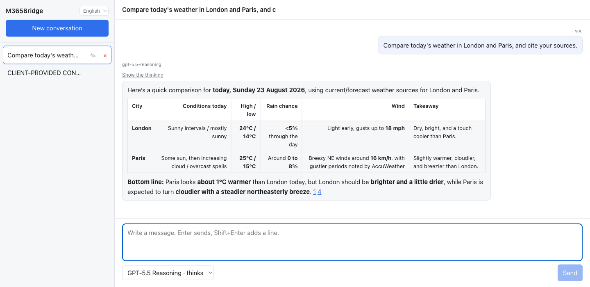
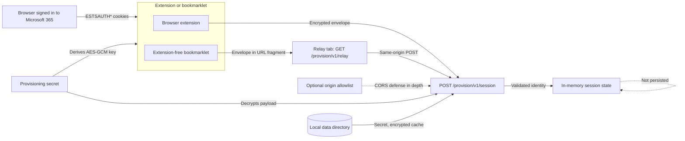
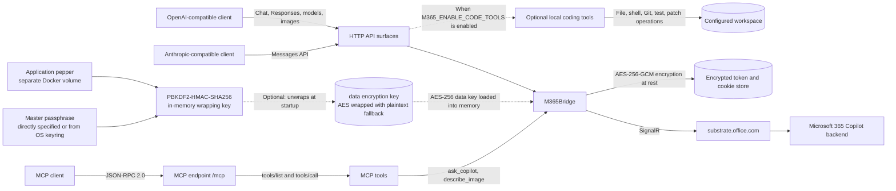

# [M365Bridge](https://github.com/KilimcininKorOglu/M365Bridge) + Auth tokens via Browser Extension

A Go implementation that converts Microsoft 365 Copilot's WebSocket interface to OpenAI/Anthropic compatible HTTP API. Point any client that speaks either protocol at this service and it works: Claude Code, Codex, Cursor, Cline, the OpenAI and Anthropic SDKs, or your own code.
On top of the original [M365Bridge](https://github.com/KilimcininKorOglu/M365Bridge), here a browser extension helps securely transferring auth tokens from the user's browser (logged in on M365) to the M365Bridge running process.



## Architecture

### Session provisioning



Both the extension and the bookmarklet need only the `ESTSAUTH` and `ESTSAUTHPERSISTENT` cookies from the current Microsoft 365 browsing session — the extension reads the browser's cookie jar for `login.microsoftonline.com` but [filters to those two names](https://github.com/ErosLever/M365Bridge/blob/main/extension/popup.js#L107) before using anything, while the bookmarklet, a page script with no cookie API access at all, has the user copy them in manually via DevTools. Neither monitors sign-in activity or touches any other cookie.

The provisioned browser cookies and derived identity remain in memory. Local persistent data can include the provisioning secret, encrypted token cache, cache data, transcripts, and the token-encryption key. Exact extension origins are an optional browser-facing restriction; the provisioning secret remains the authorization boundary. The bookmarklet's relay tab exists only to route around mixed-content blocking (the sign-in page is HTTPS, the bridge is normally plain HTTP) — it carries the same already-encrypted envelope, and only responds to requests referred from a Microsoft website (where the `ESTSAUTH`/`ESTSAUTHPERSISTENT` cookies are visible).

### API and MCP calls



The MCP surface exposes `ask_copilot` and `describe_image`. Separately, the opt-in coding-tool runtime can expose workspace-confined file listing, reading, writing and searching; shell commands; Git status, diff and log; test execution; and patch application.

## Prerequisites

- **Docker** for a container build, or **Go 1.26.6+** for local compilation ([download Go](https://go.dev/dl/)). Go 1.21 and newer can download the required 1.26.6 toolchain automatically unless `GOTOOLCHAIN` is set to `local`. The patch level is part of the requirement: every release before 1.26.6 carries standard-library vulnerabilities this service reaches through its own HTTP and TLS paths.
- A **Microsoft 365 Copilot license** (business or enterprise account with Copilot access). A Copilot Chat basic account has also been tested.
- A browser signed in to [https://m365.cloud.microsoft](https://m365.cloud.microsoft) for authentication through the browser extension or the legacy setup wizard.

## Features

- Text chat with streaming/non-streaming output
- Multimodal image input (OpenAI `image_url` and Anthropic `image` content blocks; PNG, JPEG, GIF, WebP)
- Image generation through Microsoft Designer (`/v1/images/generations`, `/v1/images/edits`) with `url` and `b64_json` response formats
- Multi-turn conversation support via ConversationId tracking
- Session isolation (per-session M365 conversations)
- Thinking/reasoning content extraction (`reasoning_content` for OpenAI, `thinking` blocks for Anthropic)
- Simulated tool calling (client-defined tools work on both OpenAI and Anthropic endpoints, streaming and non-streaming)
- OpenAI-compatible API endpoints, including the Responses API and its compaction route
- Anthropic-compatible API endpoints (dedicated SSE handlers)
- Model Context Protocol server on `/mcp` (JSON-RPC 2.0)
- Built-in coding tools the gateway runs locally, off unless `M365_ENABLE_CODE_TOOLS` turns them on
- Stop sequences on every chat endpoint, cut as the answer streams
- API key authentication (`M365_API_KEYS` / `M365_API_KEY`)
- max_tokens enforcement across all endpoints (tiktoken BPE)
- Conversation quota counters on `/v1/quota`
- CLI interface for interactive use
- Browser interface compiled into the binary (conversation list, streaming chat, model picker, markdown answers, English and Turkish)
- Single binary with subcommand routing

## Installation

#### Step 1: Provisioning secret

M365Bridge automatically generates a high-entropy provisioning secret on first startup and stores it at `data/provision-secret` with mode `0600`. Keep this file private. The browser extension uses its value to encrypt and authenticate session provisioning requests.

To create the secret before startup instead, use:

```bash
mkdir -p data
openssl rand -base64 24 > data/provision-secret
chmod 600 data/provision-secret
```

Alternatively, `docker-compose.provision-secret.yml` reads the secret from a `M365_PROVISION_SECRET` shell variable instead of a file, via a [Compose secret](https://docs.docker.com/compose/how-tos/use-secrets/). Layer it in with `-f` (see [Encrypting cached tokens at rest](docs/token-encryption.md) for the same pattern applied to the master passphrase).

#### Step 2: Build M365Bridge and package the extension

Package the browser extension normally without embedding the provisioning credential:

```bash
node extension/package.js
```

To build an installation-specific extension that pre-fills the provisioning secret, opt in explicitly:

```bash
node extension/package.js --embed-provision-secret
```

The opt-in build resolves the secret using the same precedence as the server: `M365_PROVISION_SECRET_FILE`, then `M365_PROVISION_SECRET`, then `data/provision-secret`. To create `data/provision-secret` securely when it does not exist and embed that same value, run:

```bash
node extension/package.js --embed-provision-secret --create-secret-if-missing
```

Secret creation is available only together with embedding. It generates 24 random bytes, stores the Base64 value at `data/provision-secret` with mode `0600`, and fails if another process creates the file first. The repository's `data` bind mount makes this the same file used by the container.

The generated files under `extension/dist/` contain the provisioning credential and must remain private. Do not publish, commit, archive, or distribute that build.

Docker Compose provides a manual `extension-builder` service that uses the same provisioning-secret configuration and `./data:/app/data` mount as `m365bridge`. It packages both browser targets into `extension/dist/` and then exits:

```bash
docker compose run --rm --build extension-builder \
  --embed-provision-secret \
  --create-secret-if-missing
```

The service belongs to the `tools` profile, so `docker compose up` does not start it. It also has no default packaging flags. Running it explicitly activates the service only for that command, while the supplied flags opt in to embedding and secret creation.

When using the Compose-managed provisioning secret, include the same override while packaging:

```bash
docker compose \
  -f docker-compose.yml \
  -f docker-compose.provision-secret.yml \
  run --rm --build extension-builder \
  --embed-provision-secret \
  --create-secret-if-missing
```

The override mounts the same secret at `/run/secrets/m365_provision_secret` in both services. Without the override, both services resolve the secret through the shared `data/provision-secret` file.

> **Note:** Want to build from source instead of using Docker? The upstream project documents this: a from-source build ([Option C: Build from source](https://github.com/KilimcininKorOglu/M365Bridge/blob/main/README.md#option-c-build-from-source)).

#### Step 3: Install the extension

The Chromium package supports Google Chrome, Microsoft Edge, and other compatible Chromium-based browsers. Load the same `extension/dist/chromium` directory in either browser:

- **Google Chrome:** Open `chrome://extensions`, enable **Developer mode**, select **Load unpacked**, and choose `extension/dist/chromium`.
- **Microsoft Edge:** Open `edge://extensions`, enable **Developer mode**, select **Load unpacked**, and choose `extension/dist/chromium`.
- **Firefox:** Open `about:debugging#/runtime/this-firefox`, select **Load Temporary Add-on**, and choose `extension/dist/firefox/manifest.json`.

#### Alternative: extension-free bookmarklet

Prefer not to install a browser extension? Create a bookmark whose URL
is `javascript:` followed by the contents of
[`extension/bookmarklet.min.js`](extension/bookmarklet.min.js) (most
browsers keep the `javascript:` prefix if you paste the code into an
existing bookmark's URL field — check that it's still there before
saving). Sign in to
[https://m365.cloud.microsoft](https://m365.cloud.microsoft), click the
bookmark, and an on-page overlay walks you through the same
provisioning flow as the extension: copy the `ESTSAUTH` /
`ESTSAUTHPERSISTENT` cookies from DevTools > Application > Cookies (the
overlay auto-detects and fills each one as you copy it) and the
provisioning secret from `data/provision-secret`, then submit.

Because the bridge normally runs on plain `http://` and the Microsoft
sign-in page is `https://`, the bookmarklet can't `fetch()` the
provisioning endpoint directly — browsers block that as mixed content.
It works around this by opening a small same-origin relay tab on the
bridge itself (`GET /provision/v1/relay`) that performs the POST and
reports the result back; only the already AES-GCM-encrypted envelope
ever travels in that tab's URL, and the relay only responds to requests
referred from a page under `microsoft.com`, `microsoftonline.com`, or
the `.microsoft` TLD (e.g. `m365.cloud.microsoft`). See
[`extension/MINIFICATION.md`](extension/MINIFICATION.md) for how the
bookmarklet is built from readable source down to that one-line file.

#### Step 4: Configure and start M365Bridge

Create a project-level `.env` file only when overriding the defaults, for example:

```dotenv
M365_PROVISION_AUTHORITY=organizations
```

`M365_PROVISION_ORIGINS` can optionally restrict browser provisioning requests by exact extension origin. See [Provisioning origin filtering](docs/provisioning-origin-filtering.md) for configuration and security details.

The repository includes a ready-to-use [`docker-compose.yml`](docker-compose.yml) that builds the image from the current checkout. Build and start M365Bridge:

```bash
docker compose up --build -d
```

The bridge and provisioning endpoint are now available at `http://localhost:8230`. When neither `M365_PROVISION_SECRET_FILE` nor `M365_PROVISION_SECRET` is configured, M365Bridge creates and uses `data/provision-secret`. An explicitly configured secret file must exist and contain at least 32 bytes. The existing `8230:8000` mapping serves both API and provisioning requests.

`M365_PROVISION_AUTHORITY` controls the Microsoft identity authority used for the initial browser provisioning flow. It defaults to `organizations`; set it to `common` or an exact tenant ID when required. The tenant ID derived from the resulting access token still becomes the runtime authority after provisioning.

#### Optional: Encrypt cached tokens at rest

The expected setup uses a master passphrase and a [pepper](https://en.wikipedia.org/wiki/Pepper_%28cryptography%29) to wrap the AES data key in `data/tokens/encryption.key.enc`. If no master passphrase is configured, M365Bridge falls back to storing the key in plaintext at `data/tokens/encryption.key` and prints security warnings. See [Encrypting cached tokens at rest](docs/token-encryption.md) for setup and details.

#### Step 5: Provision the Microsoft 365 session

Sign in to [https://m365.cloud.microsoft](https://m365.cloud.microsoft) in the browser where the extension is installed. Open the extension, enter `http://127.0.0.1:8230` and the value from `data/provision-secret`, then select **Provision M365Bridge**.

The extension encrypts the required Microsoft login cookies with AES-GCM using a key derived from the provisioning secret. The raw secret and plaintext cookies are not sent over the network. Each request includes a short-lived timestamp and one-time request ID to reject stale or replayed payloads.

M365Bridge validates the primary and broker authentication flows, obtains fresh tokens, and derives the current user OID and tenant ID from the access token. Provisioned cookies and the derived identity are kept in memory, so provision again after every container restart or whenever the Microsoft browser session changes.

#### Step 6: Connect OpenCode or another client

Configure OpenCode or any OpenAI-compatible client with this API base URL:

```text
http://127.0.0.1:8230/v1
```

After provisioning succeeds, the client can use the chat, responses, models, and other compatible endpoints documented below.

#### Alternative: docker run

If you prefer `docker run` instead of Docker Compose, build the image from the current source tree first:

```bash
docker build -t m365bridge:local .

docker run -d \
  --name m365bridge \
  -p 8230:8000 \
  -e M365_PROVISION_AUTHORITY=organizations \
  -v "$(pwd)/data:/app/data" \
  --restart unless-stopped \
  m365bridge:local
```

Optional origin filtering is documented in [Provisioning origin filtering](docs/provisioning-origin-filtering.md). Continue with Steps 5 and 6 above.

`docker run` has no equivalent to Compose's env-sourced secrets; see [Encrypting cached tokens at rest](docs/token-encryption.md) for the `docker run` alternative.

#### Notes

- The `data/` directory stores tokens, cache, and configuration. It is created automatically on first run.
- Port `8230` (host) maps to port `8000` (container). Change the host port in `docker-compose.yml` or the `-p` flag if needed.
- The container starts with `serve --port 8000` by default.
- Browser provisioning uses the existing server port and does not require another published port.
- Without a master passphrase configured, `data/tokens/encryption.key` is a plaintext AES key; anyone who can read the `data/` directory can decrypt cached tokens. See [Encrypting cached tokens at rest](docs/token-encryption.md).

## Usage

### Core Environment Variables

Configuration is read from `data/.env`; a process environment variable takes precedence over the file. The setup wizard writes the first two.

| Variable         | Default                                | Description                                                                                          |
|------------------|----------------------------------------|------------------------------------------------------------------------------------------------------|
| `M365_TENANT_ID` | required                               | Directory (tenant) ID. The CLI and the server both exit without it.                                  |
| `M365_USER_OID`  | required                               | Object ID of the signed-in user. The CLI and the server both exit without it.                        |
| `M365_CLIENT_ID` | `4765445b-32c6-49b0-83e6-1d93765276ca` | OAuth client the access tokens are issued to. Change it only for a tenant that blocks the default.   |
| `M365_API_KEYS`  | unset                                  | Comma-separated keys a client must present. Unset leaves every `/v1/*` route and `/mcp` open.        |
| `M365_API_KEY`   | unset                                  | A single key, read only when `M365_API_KEYS` is unset.                                               |
| `TZ`             | system zone                            | Timezone sent with each turn. Without it the zone comes from `/etc/localtime`, then UTC.             |

The following variables are specific to this fork:

| Variable | Default | Description |
|----------|---------|-------------|
| `M365_PROVISION_SECRET` | unset | Shared secret used to authenticate browser-extension provisioning. Used when no secret file is configured. |
| `M365_PROVISION_SECRET_FILE` | unset | File containing the provisioning secret. Takes precedence over `M365_PROVISION_SECRET`; when both are unset, `data/provision-secret` is loaded or generated. |
| `M365_PROVISION_ORIGINS` | unset | Comma-separated extension origins allowed to provision. Unset accepts extension origins; `*` disables origin filtering. |
| `M365_PROVISION_AUTHORITY` | `organizations` | Microsoft identity authority used during provisioning. |
| `M365_MASTER_PASSPHRASE_VALUE` | unset | Master passphrase used to wrap the credential-encryption key. Takes precedence over the file setting. |
| `M365_MASTER_PASSPHRASE_FILE` | unset | File containing the master passphrase used to wrap the credential-encryption key. |

`m365-bridge --help` prints all supported variables with their current defaults.

For additional command-line, HTTP API, session, and configuration details omitted from this streamlined guide, see the [original M365Bridge README](https://github.com/KilimcininKorOglu/M365Bridge#readme).

### OpenCode

Create or update the global OpenCode configuration file at `~/.config/opencode/opencode.json` (or `~/.config/opencode/opencode.jsonc`) with the following provider configuration:

```json
{
  "$schema": "https://opencode.ai/config.json",
  "provider": {
    "m365bridge": {
      "npm": "@ai-sdk/openai-compatible",
      "name": "m365bridge",
      "options": {
        "baseURL": "http://localhost:8230/v1",
        "apiKey": "****************"
      },
      "models": {
        "gpt-5.6-reasoning": {
          "name": "gpt-5.6-reasoning",
          "capabilities": {
            "tools": true,
            "input": ["text", "image"],
            "output": ["text"]
          },
          "limit": {
            "context": 200000,
            "output": 50000
          }
        }
      }
    }
  }
}
```

Replace the masked API key with your configured M365Bridge API key (if defined). Quit and restart OpenCode after changing its configuration, then start it directly with this provider and model:

```bash
opencode -m m365bridge/gpt-5.6-reasoning
```

## Web Interface

Open the server's root URL in a browser (`http://localhost:8230/` under the shipped Docker setup). The interface is compiled into the binary, so there is no separate asset directory and no second process to run.

It lists conversations in a sidebar, streams answers as they arrive, lets you pick a model from `GET /v1/models`, and creates, renames and deletes conversations. An answer is rendered as markdown, so a comparison table is a table and a citation is a link rather than a URL in the middle of a sentence. The reasoning block behind **Show the thinking** is rendered the same way, because the backend writes that in markdown too. What you typed is shown exactly as you typed it. Rename and delete ask in the page rather than through the browser's own dialogs.

The [original project documentation](https://github.com/KilimcininKorOglu/M365Bridge#browser-interface) covers interface addresses, transcripts, authentication, localization, and rebuilding the web assets in more detail.

## Models

All model selection is via the `tone` field sent to the M365 backend. The `Override` field is empty for all models. GPT-5.x models route to the GPT-5 backend. Claude tone values return Claude responses, but M365 does not expose the underlying model identity in SignalR metadata.

| Key                        | Tone              | OpenAI ID         | Thinking? | Backend |
|----------------------------|-------------------|-------------------|-----------|---------|
| `auto`                     | Magic             | gpt-4-auto        | No        | GPT-5   |
| `quick`                    | Chat              | gpt-4-quick       | No        | GPT-5   |
| `reasoning`                | Gpt_5_2_Reasoning | gpt-4-reasoning   | Yes       | GPT-5   |
| `gpt5.2-reasoning`         | Gpt_5_2_Reasoning | gpt-5.2-reasoning | Yes       | GPT-5   |
| `gpt5.4-reasoning`         | Gpt_5_4_Reasoning | gpt-5.4-reasoning | Yes       | GPT-5   |
| `gpt5.2`                   | Gpt_5_2_Chat      | gpt-5.2           | No        | GPT-5   |
| `gpt5.3`                   | Gpt_5_3_Chat      | gpt-5.3           | No        | GPT-5   |
| `gpt5.4`                   | Gpt_5_4_Chat      | gpt-5.4           | No        | GPT-5   |
| `gpt5.5`                   | Gpt_5_5_Chat      | gpt-5.5           | No        | GPT-5   |
| `gpt5.5-reasoning`         | Gpt_5_5_Reasoning | gpt-5.5-reasoning | Yes       | GPT-5   |
| `gpt5.6-reasoning`         | Gpt_5_6_Reasoning | gpt-5.6-reasoning | Yes       | GPT-5   |
| `claude`                   | Claude_Sonnet     | claude-sonnet-4.6 | No        | Claude  |
| `claude-sonnet`            | Claude_Sonnet     | claude-sonnet-4.6 | No        | Claude  |
| `claude-opus`              | Claude_Opus       | claude-opus-4.6   | Yes       | Claude  |
| `claude-sonnet-4-20250514` | Claude_Sonnet     | claude-sonnet-4.6 | No        | Claude  |

### Which model should I use?

| Use case                                  | Model              |
|-------------------------------------------|--------------------|
| General purpose, let backend decide       | `auto`             |
| Fast responses, simple questions          | `quick`            |
| Complex reasoning, multi-step problems    | `reasoning`        |
| GPT-5.2 with deep thinking                | `gpt5.2-reasoning` |
| GPT-5.4 with deep thinking                | `gpt5.4-reasoning` |
| GPT-5.2 chat                              | `gpt5.2`           |
| GPT-5.3 chat                              | `gpt5.3`           |
| GPT-5.4 chat                              | `gpt5.4`           |
| GPT-5.5 chat                              | `gpt5.5`           |
| GPT-5.5 with deep thinking                | `gpt5.5-reasoning` |
| GPT-5.6 with deep thinking (latest)       | `gpt5.6-reasoning` |
| Claude Sonnet 4.6 (Anthropic)             | `claude-sonnet`    |
| Claude Opus 4.6 (Anthropic, most capable) | `claude-opus`      |

A reasoning model produces `reasoning_content` output containing the model's thinking process. OpenAI endpoints expose this as `reasoning_content`; Anthropic endpoints expose it as a `thinking` content block before the `text` block. `claude-opus` produces reasoning content as well; `claude-sonnet` does not. `gpt5.6-reasoning` advertises the capability but has not been observed emitting it. The advertised capability comes from the measured behaviour of each tone rather than from its name.

## MCP Server

`POST /mcp` exposes M365 Copilot to Model Context Protocol clients over JSON-RPC 2.0 (protocol revision `2025-06-18`). It supports `initialize`, `tools/list`, `tools/call`, and `ping`; lifecycle notifications are acknowledged with `202` and no body. The route requires an API key when one is configured.

The registry carries the vendor names agent clients send, so `claude-sonnet-4-20250514` resolves. `gpt-4o` and `o1` do not, and return `404`. A request with no model at all defaults to `gpt5.5-reasoning` rather than to `auto`, since it is the reasoning tone that is reliable for tool calling. This covers an empty `model` field, a missing one, and a bare `:session-id` suffix.

### Advertised context window

Each entry in `GET /v1/models` advertises `context_window` and `max_output_tokens`, controlled by `M365_CONTEXT_WINDOW` and `M365_MAX_OUTPUT_TOKENS` (both default to `1000000`), so client harnesses do not pre-truncate prompts or output. These are hints for the client only; M365 enforces its own limits regardless.

### Conversation quota

M365 enforces a per-conversation message ceiling and reports the counters on its update frames. `GET /v1/quota` returns the last observed counters (`used`, `max`, `headroom`), reflecting the most recent chat request rather than a live lookup. When a request produces an empty upstream response and the last counters show the ceiling was reached, the proxy answers `429 upstream_throttled` instead of a generic empty-response error. Start a new session to continue.

### Copilot memory

M365 Copilot keeps a memory on the account that reaches every turn regardless of which conversation the turn belongs to; a brand-new conversation can surface content and preferences from unrelated earlier sessions. `GET /v1/personalization` reports the account's settings, and `PATCH /v1/personalization` with `{"memory_enabled": false}` changes the switch (the browser interface exposes the same control in its sidebar). Turning memory off also turns off insights from conversation history, since the backend moves the two together.

**This is your real M365 account setting** — it applies to the M365 web and mobile Copilot too, and the proxy only reports it until someone moves the switch. A tenant that forbids personalization answers `409 personalization_disabled_by_tenant`.

### Token usage

Prompt and completion token counts are estimated locally with `o200k_base` (falling back to `cl100k_base`, then a character estimate), since the M365 backend reports no usage. Every `usage` object names the source via the non-standard `usage_source` field, alongside a `reasoning_tokens` count. `/v1/chat/completions` and `/v1/completions` accept the OpenAI `stream_options` object; unlike upstream OpenAI, leaving it out keeps the usage object on a streaming turn rather than withholding it.

### Stop sequences

Every chat endpoint accepts a stop sequence under its own protocol's name (`stop` for the OpenAI routes, `stop_sequences` for the Anthropic ones). The answer is cut just before the earliest sequence that appears in it, and the sequence itself is removed. A streamed answer is cut as it is produced: a sequence can straddle two upstream chunks, so the writer holds back a tail that could still complete one.

## MCP Server

`POST /mcp` exposes M365 Copilot to Model Context Protocol clients over JSON-RPC 2.0 (protocol revision `2025-06-18`). It supports `initialize`, `tools/list`, `tools/call`, and `ping`; lifecycle notifications are acknowledged with `202` and no body. The route requires an API key when one is configured.

| Tool | Arguments | Description |
|------|-----------|-------------|
| `ask_copilot` | `prompt` (required), `model` | One stateless Copilot turn returning text |
| `describe_image` | `image_url` (required, data URI), `prompt` | Asks Copilot about an inline image |

```bash
curl -s -X POST http://localhost:8000/mcp \
  -H "Content-Type: application/json" \
  -d '{"jsonrpc":"2.0","id":1,"method":"tools/call","params":{"name":"ask_copilot","arguments":{"prompt":"Summarize the CAP theorem"}}}'
```

Copilot is deliberately a leaf in the MCP role. The simulated tool calling used by the `/v1` endpoints is **not** offered through MCP: an MCP client already has a real, schema-enforced tool mechanism, and nesting the prompt-based emulation inside it would create two competing tool loops. Every MCP call is an independent turn with no conversation continuity.

## Tool Calling

M365Bridge supports **simulated tool calling** — client-defined tools (Claude Code's Read/Bash/Write, Codex tools, etc.) work without M365 backend natively supporting them.

### How It Works

1. Client sends a request with `tools` array (OpenAI function definitions or Anthropic tool schemas)
2. M365Bridge embeds the entire request JSON into the prompt sent to M365 Copilot
3. M365 Copilot returns a full response JSON in a ```` ```json ```` block
4. M365Bridge parses the response and extracts tool calls into OpenAI `tool_calls` or Anthropic `tool_use` content blocks
5. Client executes the tool and sends the result back in the next message

This works on both OpenAI (`/v1/chat/completions`) and Anthropic (`/v1/messages`) endpoints, in both streaming and non-streaming modes.

For complete request and response examples, schema validation behavior, client-driven tool loops, and optional built-in coding tools, refer to the [upstream tool-calling documentation](https://github.com/KilimcininKorOglu/M365Bridge/blob/main/TOOL-CALLING.md).

## Built-in coding tools (opt-in)

M365Bridge can run a restricted set of local coding operations on the server. This is **off by default**; `M365_ENABLE_CODE_TOOLS=1` is its main gate. It is available on `/v1/chat/completions`, `/v1/messages` and `/v1/responses`.

Once enabled, tools explicitly included in a request are recognized and executed locally. `M365_AUTO_EXPOSE_TOOLS=1` also adds every built-in tool to requests automatically; leave it at `0` when clients should select tools explicitly. The server sends local results back to the model and continues until the model returns a final answer, emits a caller-defined tool call, or reaches the iteration limit. Because calls and intermediate results must be collected first, a request using built-in tools buffers the complete model response even when `stream: true`, then emits the provider-compatible streaming response.

### Settings

| Variable                        | Default   | Description                                                                                    |
|---------------------------------|-----------|------------------------------------------------------------------------------------------------|
| `M365_ENABLE_CODE_TOOLS`        | `0`       | Main gate. Set to `1` to enable local tool execution.                                          |
| `M365_AUTO_EXPOSE_TOOLS`        | `0`       | Set to `1` to inject all built-in tool schemas when the client does not provide them.          |
| `M365_WORKSPACE_DIR`            | `.`       | Existing directory that confines file and Git operations.                                      |
| `M365_CODE_TOOL_TIMEOUT`        | `30s`     | Timeout for each command or test execution. Accepts Go duration syntax, such as `10s` or `2m`. |
| `M365_CODE_TOOL_MAX_OUTPUT`     | `1048576` | Maximum captured command output in bytes. Longer output is truncated.                          |
| `M365_CODE_TOOL_MAX_READ_BYTES` | `1048576` | Maximum number of bytes returned by a file read.                                               |
| `M365_CODE_TOOL_MAX_ITERATIONS` | `10`      | Maximum model and tool loop iterations per request.                                            |

Set these in `data/.env`. Under Docker, `M365_WORKSPACE_DIR` must name a directory that already exists inside the container. The provided compose file mounts only `./data` at `/app/data`; it exposes no host source workspace.

### The tools

| Tool            | Operation                                                        |
|-----------------|------------------------------------------------------------------|
| `list_files`    | List files and directories under a workspace path.               |
| `read_file`     | Read a file, subject to the configured byte limit.               |
| `write_file`    | Create or replace a file inside the workspace.                   |
| `search_files`  | Search workspace file contents.                                  |
| `git_status`    | Show workspace Git status.                                       |
| `git_diff`      | Show workspace Git changes.                                      |
| `git_log`       | Show recent workspace Git history.                               |
| `shell_command` | Run a shell command with the workspace as its working directory. |
| `apply_patch`   | Apply a unified patch inside the workspace.                      |
| `run_tests`     | Run a test command with the configured timeout and output limit. |

### Before you enable them

Enabling these tools turns the API into a remote code execution and file access surface. **Configure `M365_API_KEYS` or `M365_API_KEY` first. API key authentication is mandatory for every deployment with coding tools enabled.** Do not expose such a deployment directly to the public internet. Use a least-privilege service account, a dedicated workspace, strict filesystem permissions, network isolation and container resource limits.

- **Broken access control**: a missing, leaked or shared API key lets unauthorized callers read, modify or execute within the mounted workspace. Use unique, rotated keys and enforce authorization at a trusted reverse proxy as well.
- **Command injection**: `shell_command` and `run_tests` execute model-selected command strings. Treat prompts, repository content, patches and tool arguments as untrusted input. Isolate the process and never provide production credentials.
- **Path traversal**: the file tools confine resolved paths to `M365_WORKSPACE_DIR`, but an overly broad workspace or an unsafe mount still exposes sensitive files. Mount only the project directory you need, and review symlinks and permissions.
- **Sensitive data exposure**: tool output and file contents are returned to the caller and sent to the M365 backend. Keep secrets, tokens, `.env` files, SSH keys, cloud credentials and customer data outside the workspace.
- **Resource exhaustion**: commands, recursive searches, large files, large output and repeated tool loops consume CPU, memory, disk and process capacity. Keep the timeout, output, read and iteration limits conservative, and enforce container or OS quotas.

## Responses API

`/v1/responses` implements the OpenAI Responses API. It accepts `input` as a string or an array of typed items, plus `instructions`, `max_output_tokens`, `tools`, `reasoning` and `previous_response_id` for conversation continuity.

### Reasoning effort

Codex CLI sends `reasoning: {"effort": ..., "summary": ...}`. The accepted effort values are `none`, `minimal`, `low`, `medium`, `high`, `xhigh` and `max`. Anything else is rejected with HTTP 400 rather than ignored.

M365 exposes no separate effort dial, so effort steers the only lever that exists: `medium` and above routes the request to the model's reasoning variant when the registry has one, for example `gpt5.5` to `gpt5.5-reasoning`. A model without a variant, or a key that already names one, is left unchanged. `summary` is accepted and not acted on.

### Custom tools

A tool declared with `"type": "custom"` takes free-form text rather than JSON arguments. Its calls come back as `custom_tool_call` items with the text under `input`, and the matching `custom_tool_call` and `custom_tool_call_output` history items are read back on the next turn.

### Example

```bash
curl http://127.0.0.1:8000/v1/responses \
  -H "Content-Type: application/json" \
  -H "Authorization: Bearer your-api-key" \
  -d '{
    "model": "gpt5.5",
    "input": "What is 2+2?",
    "session_id": "my-session"
  }'
```

```json
{
  "id": "resp_...",
  "object": "response",
  "created_at": 1234567890,
  "status": "completed",
  "model": "gpt-5.5",
  "output": [{
    "id": "msg_...",
    "type": "message",
    "status": "completed",
    "role": "assistant",
    "content": [{"type": "output_text", "text": "2+2 equals 4.", "annotations": []}]
  }],
  "output_text": "2+2 equals 4.",
  "usage": {"input_tokens": 5, "output_tokens": 8, "total_tokens": 13}
}
```

With instructions and typed input items:

```bash
curl http://127.0.0.1:8000/v1/responses \
  -H "Content-Type: application/json" \
  -H "Authorization: Bearer your-api-key" \
  -d '{
    "model": "gpt5.5-reasoning",
    "instructions": "You are a concise assistant.",
    "input": [{"role": "user", "content": [{"type": "input_text", "text": "Explain recursion"}]}],
    "stream": true
  }'
```

### Streaming events

| Event                                    | Description                                                  |
|------------------------------------------|--------------------------------------------------------------|
| `response.created`                       | Response object created, status `in_progress`                |
| `response.in_progress`                   | Response is being generated                                  |
| `response.output_item.added`             | New output item added: message, reasoning or function call   |
| `response.content_part.added`            | Content part added to a message item                         |
| `response.output_text.delta`             | Text delta                                                   |
| `response.output_text.done`              | Text complete                                                |
| `response.content_part.done`             | Content part complete                                        |
| `response.output_item.done`              | Output item complete                                         |
| `response.reasoning_summary_part.added`  | Reasoning part opened                                        |
| `response.reasoning_summary_text.delta`  | Reasoning delta                                              |
| `response.reasoning_summary_text.done`   | Reasoning complete                                           |
| `response.reasoning_summary_part.done`   | Reasoning part closed                                        |
| `response.function_call_arguments.delta` | Tool call arguments delta                                    |
| `response.function_call_arguments.done`  | Tool call arguments complete                                 |
| `response.completed`                     | Full response object, status `completed`                     |
| `response.failed`                        | An error occurred, status `failed`                           |

### Codex compatibility

Codex CLI opens a provider with two probes before it sends any chat request.

- `GET /v1/health` answers `{"status": "ok"}` without an API key and without touching the upstream. A 404 there makes Codex mark the whole provider unreachable.
- A `POST /v1/responses` whose input carries no text, image, tool call or tool result is answered locally with an empty but well-formed Response, streaming or not. Sending that empty turn upstream cost about twelve seconds and one message of the conversation quota. A request carrying `instructions` is a real turn and still reaches M365.

Every streaming endpoint writes a keepalive frame after ten idle seconds, because a tool-enabled turn buffers its text until the tool-call parse completes. The OpenAI-shaped routes send an SSE comment, which no client parses as data; `/v1/messages` and `/v1/complete` send the Anthropic `ping` event.

`/v1/chat/completions` and `/v1/completions` also write that comment the moment the stream opens, before the upstream turn starts. Every other streaming route already emits a frame first (`message_start`, `ping` or `response.created`), so a client never has to tell a slow provider from a dead one.

Two more rules protect a stream whose client went away. Each frame arms a thirty-second write deadline, so a reader that stopped consuming cannot hold the handler and its upstream WebSocket open. A failed keepalive write, or a canceled request context, ends the turn and releases the upstream connection instead of writing into a closed socket.

## Responses Compact API

`/v1/responses/compact` implements the OpenAI Responses Compact API for Codex remote compaction. It accepts the same request body as `/v1/responses` and returns a response containing exactly one `compaction` output item.

1. The conversation history is flattened into a single user message carrying a compaction prompt.
2. That message goes to Copilot, which produces a concise summary.
3. The summary is returned wrapped in a `compaction` output item under `encrypted_content`.

```bash
curl http://127.0.0.1:8000/v1/responses/compact \
  -H "Content-Type: application/json" \
  -H "Authorization: Bearer your-api-key" \
  -d '{
    "model": "gpt5.5-reasoning",
    "input": [
      {"role": "user", "content": "Fix the auth bug in sso.go"},
      {"role": "assistant", "content": "I added the missing sso_reload parameter."},
      {"role": "user", "content": "Now add logging to the refresh path"}
    ]
  }'
```

```json
{
  "id": "resp_...",
  "object": "response",
  "status": "completed",
  "output": [{
    "id": "cmp_...",
    "type": "compaction",
    "encrypted_content": "The conversation focused on fixing an SSO auth bug..."
  }]
}
```

Streaming mode emits the same event sequence as `/v1/responses`, but the output item carries `type: "compaction"` instead of `type: "message"`.

Custom `instructions` in the request body override the default compaction prompt. Use a new session ID rather than reusing an existing conversation, which gives better results.

## Image input

The proxy accepts images in both protocols:

- **OpenAI**: `{"type": "image_url", "image_url": {"url": "data:image/png;base64,..."}}`
- **Responses**: `{"type": "input_image", "image_url": "data:image/png;base64,..."}`, where the url is a bare string
- **Anthropic**: `{"type": "image", "source": {"type": "base64", "media_type": "image/png", "data": "..."}}`

An `image_url` block accepts the bare string form as well, because clients send it under both block names. A `file_id` reference is not supported; this gateway serves no Files API to resolve one against.

Images are uploaded to `POST https://substrate.office.com/m365Copilot/UploadFile` and attached to the WebSocket message as `messageAnnotations`. PNG, JPEG, GIF and WebP are supported.

`input_file`, `file`, `input_audio` and `audio` blocks are dropped with a DEBUG log entry, because the M365 backend accepts image attachments only.

### Remote image URLs

An OpenAI `image_url` block may carry a remote `https://` address instead of a data URL. The proxy downloads it before uploading.

No credential is sent on that download, so any public https host is accepted. The request is still checked, to keep the proxy from being used to reach addresses inside its own network: plain http, loopback, private, link-local, multicast, carrier-grade NAT and cloud metadata targets are rejected, and the host is re-checked after DNS resolution. A response larger than 20 MB, one whose content type is not an image, or one that fails outright drops that single image rather than the whole request. At most 16 remote images are fetched per turn.

Anthropic `image` blocks carry base64 data directly and are unaffected.

## Image generation

An image can also come out of an ordinary chat turn. Asking for one in `/v1/chat/completions`, `/v1/messages`, `/v1/completions` or `/v1/responses` puts a markdown image link in the answer, and the image stays part of the conversation, so the next turn can ask for a change to it.

The address M365 puts in that link cannot be fetched by whoever reads the answer: the download needs the designer access token in `Authorization` plus the `fileToken` as its own header, and an `` element sends neither. So the proxy replaces the address with a route of its own before the answer goes out, and downloads the image itself when that route is called:

```

```

The path is root-relative, so a client resolves it against the base URL it already uses, and it sits behind the API key like every other `/v1` route. The reference is minted by the proxy and lives in memory: a restart drops it, and it expires on its own after twelve hours, which is also roughly how long the address behind it stays valid. A reference the proxy no longer holds answers `404 image_not_found`, and the browser interface shows a short note in place of the image. An address the [host allowlist](#host-allowlist) refuses is removed from the answer rather than passed on, for the reason a generated URL is never handed to a client directly.

Generating a picture takes about a minute, and M365 sends no answer text while it works. It does announce the start, so a streaming response carries an SSE comment as soon as that announcement arrives:

```
: notice image_generating
```

A comment enters no field contract, so every OpenAI and Anthropic client ignores it exactly as it ignores the keepalive comment. The browser interface reads it and shows a line saying the image is being generated; the first content of the answer replaces that line, and because the notice was never answer text, nothing has to be taken back and nothing reaches the transcript. The read timeout is raised to three minutes for the rest of a turn that started generating an image.

The separate Images API endpoints stay one-shot and return the image data itself:

- `POST /v1/images/generations`, JSON body, generates from a text prompt
- `POST /v1/images/edits`, multipart form, edits existing images; up to 16 through repeated `image` fields

| Parameter         | Type   | Default     | Description                                                                       |
|-------------------|--------|-------------|-----------------------------------------------------------------------------------|
| `prompt`          | string | required    | The text prompt                                                                   |
| `n`               | int    | 1           | Number of images; M365 generates one per request                                  |
| `size`            | string | `1024x1024` | Size hint appended to the prompt as natural language; `1024x1024` is skipped      |
| `quality`         | string | `standard`  | Quality hint appended to the prompt; `standard` is skipped                        |
| `style`           | string | `natural`   | Style hint appended to the prompt; `natural` is skipped                           |
| `response_format` | string | `url`       | `url` returns a data URL, `b64_json` returns base64 in a separate field           |
| `session_id`      | string | optional    | Session ID for conversation continuity                                            |
| `user`            | string | optional    | Read as the session ID when `session_id` is absent                                |

With `response_format=url`, the proxy downloads the image server-side and returns a `data:image/png;base64,...` URL, falling back to the raw `designerapp.officeapps.live.com` URL if the download fails. With `b64_json`, it downloads using a broker token and returns base64-encoded PNG data.

```python
from openai import OpenAI
import base64

client = OpenAI(base_url="http://localhost:8230/v1", api_key="your-api-key")

resp = client.images.generate(
    model="gpt5.5-reasoning",
    prompt="a serene mountain landscape at sunset",
    n=1,
    response_format="b64_json",
)

with open("output.png", "wb") as f:
    f.write(base64.b64decode(resp.data[0].b64_json))
```

### Host allowlist

Generated-image URLs are read out of the model's own markdown output, which is untrusted, and the download sends the designerapp access token. The proxy therefore contacts only allowlisted hosts, requires `https`, and rejects hosts resolving to loopback, private, link-local, carrier-grade NAT or cloud metadata addresses. A URL failing these checks is dropped rather than returned.

| Variable                    | Default                | Description                                                                                                   |
|-----------------------------|------------------------|---------------------------------------------------------------------------------------------------------------|
| `M365_IMAGE_HOST_ALLOWLIST` | `.officeapps.live.com` | Comma-separated hosts that may serve generated images. An entry starting with a dot matches that domain and its subdomains. |

### Download token flow

To download a generated image the proxy acquires a JWE access token for `designerappservice.officeapps.live.com` through the MSAL.js broker token flow:

1. The broker app (`c0ab8ce9`) acquires a token on behalf of the M365 web app (`4765445b`) with the `designerappservice.officeapps.live.com/.default` scope.
2. A broker-compatible refresh token is stored encrypted at `data/tokens/rt_broker.txt` and rotated by the background token refresher.
3. If no broker refresh token exists, one is acquired through the SSO cookie broker authorize flow, using PKCE and the `brk-multihub://outlook.office.com` redirect URI.
4. The JWE token and a `fileToken` header download the image from `designerapp.officeapps.live.com`.

## Project structure

```
cmd/cli/main.go            # Single entry point, subcommand router
pkg/
  atomicfile/              # Write-and-rename, so a crash cannot leave a half-written credential
  auth/auth.go             # TokenManager, token refresh, AES-encrypted refresh token storage
  auth/sso.go              # SSO cookie re-authentication and the designer broker token flow
  client/client.go         # M365Client, one SignalR WebSocket per request
  client/conversations.go  # ConversationClient: list, rename and delete web conversations
  client/history.go        # Reads the turns of a conversation from its rendered page
  client/citations.go      # Citation resolution in streamed answer text
  client/errors.go         # UpstreamError, carrying the status of a failed dial or upload
  codingtools/             # Built-in local tools, gated by M365_ENABLE_CODE_TOOLS
  crypto/crypto.go         # AES-256-GCM encryption for refresh tokens
  logging/                 # Application logging
  models/models.go         # Version, ModelRegistry, Config, LoadConfig, FindModel
  payload/payload.go       # Request payload builders, URL builder, locale/timezone helpers
  servers/
    api.go                 # HTTP adaptation: every endpoint, token counting, session isolation
    auth.go                # Browser interface auth mode and credential verification routes
    cli.go                 # CLI server, interactive mode
    errors.go              # The one error shape every route reports
    mcp.go                 # JSON-RPC 2.0 Model Context Protocol server
    provisioning.go        # Session provisioning (/provision/v1/session) and the bookmarklet's mixed-content relay (/provision/v1/relay)
    sessions.go            # The session to conversation mapping routes
    stopsequence.go        # Stop sequence cutting, including the streaming writer
    transcripts.go         # The only place message content reaches disk
    webui.go               # Serves the embedded browser interface
  setup/wizard.go          # Browser-based setup wizard (JS snippet, token verify, data/.env save)
  textcut/                 # Rune-boundary-safe cutting
  toolcalling/             # Simulated caller-defined tool calling, its parsers and detectors
  webui/embed.go           # The built interface, compiled into the binary
go.mod                     # Module: github.com/KilimcininKorOglu/M365Bridge, Go 1.26
extension/                 # Browser extension and extension-free bookmarklet for secure M365 session provisioning
web/                       # Vite project for the interface; make ui builds it into pkg/webui/dist
docs/                      # Screenshots used by the READMEs
data/                      # Runtime data (gitignored): tokens/, setup.json, cache/, provisioning secret, transcripts/
```

## Dependencies

Three direct dependencies, and one they pull in.

| Dependency                      | Purpose                                                               |
|---------------------------------|-----------------------------------------------------------------------|
| `github.com/google/uuid`        | UUID generation for SIDs and request IDs                              |
| `github.com/gorilla/websocket`  | WebSocket client for SignalR                                          |
| `github.com/pkoukk/tiktoken-go` | BPE token counting (o200k_base, cl100k_base fallback) for usage and max_tokens enforcement |
| `github.com/dlclark/regexp2`    | Indirect; the regex engine tiktoken-go splits text with              |

## Security

- Refresh tokens encrypted with AES-256-GCM before storage
- SSO and M365 web cookies encrypted with AES-256-GCM before storage (`data/tokens/sso_cookies.json` and `data/tokens/m365_cookies.json`)
- Legacy plaintext M365 cookie stores are encrypted automatically on first use
- The expected configuration stores the AES data key wrapped under a master passphrase in `data/tokens/encryption.key.enc`; without a passphrase, the service falls back to plaintext `data/tokens/encryption.key` and prints security warnings. Losing either key file makes the encrypted credentials unreadable and requires provisioning the browser session again. See [Encrypting cached tokens at rest](docs/token-encryption.md).
- Access tokens cached in `data/tokens/token_cache.json` (disk-persisted, ~1h expiry with 60s buffer)
- Background token refresher proactively refreshes access token every 30 minutes in `serve` mode
- SSO cookie auto-renewal silently re-authenticates when refresh token expires (24h SPA limit)
- No credentials stored in code or repository
- `data/` directory is gitignored (contains tokens, cache, and the provisioning secret)
- API key authentication protects all `/v1/*` endpoints when configured
- The key is read from `Authorization: Bearer <key>` or `x-api-key: <key>`; when a client offers both, either one being valid is enough

## Image Input Support

The proxy supports multimodal image input via OpenAI and Anthropic API formats:

- **OpenAI**: `content` array with `{"type": "image_url", "image_url": {"url": "data:image/png;base64,..."}}` blocks
- **Responses**: `content` array with `{"type": "input_image", "image_url": "data:image/png;base64,..."}` blocks, where the url is a bare string
- **Anthropic**: `content` array with `{"type": "image", "source": {"type": "base64", "media_type": "image/png", "data": "..."}}` blocks

An `image_url` block accepts the bare string form as well, because clients send it under both block names. A `file_id` reference is not supported; this gateway serves no Files API to resolve one against.

Images are uploaded to the M365 backend via `POST https://substrate.office.com/m365Copilot/UploadFile` and attached to the WebSocket message as `messageAnnotations`. Supported formats: PNG, JPEG, GIF, WebP.

See the [original M365Bridge README](https://github.com/KilimcininKorOglu/M365Bridge#image-input-support) for additional image-input examples and remote image URL behavior.

## Image Generation

The proxy exposes M365 Copilot's Microsoft Designer image generation as OpenAI Images API endpoints:

- `POST /v1/images/generations` (JSON body): Generate images from a text prompt (no file upload)
- `POST /v1/images/edits` (multipart/form-data): Edit existing image(s) with a text prompt; supports up to 16 images via repeated `image` form fields

## Unimplemented Features

- File upload
- Code interpreter

## Disclaimer

This project is for learning and research purposes only. It explores publicly observable network communication protocols.

By using this project, you confirm that:
- You have legitimate Microsoft 365 Copilot authorization
- It is for personal learning and research, not commercial use
- You understand the risks of using unofficial interfaces
- You accept all consequences

This project does not:
- Crack encryption or bypass authentication
- Access or leak others' data
- Interfere with Microsoft services
- Have any association with Microsoft Corporation

## License

Research Only
